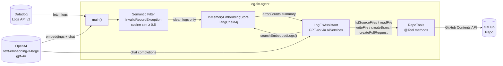

# log-fix-agent

An AI-powered agent that fetches error logs from Datadog, filters out expected `InvalidRecordException` noise, identifies distinct error types, and autonomously opens a separate GitHub PR with a fix for each one.

Built with [LangChain4j](https://github.com/langchain4j/langchain4j) AiServices, OpenAI GPT-4o, and the GitHub Contents API.

## Flow

```mermaid
flowchart TD
    A([Start]) --> B[Fetch logs from Datadog\nlast 120 min, service:java-csv-datadog-demo]
    B --> C{Logs returned?}
    C -- No --> Z([Exit: nothing to fix])
    C -- Yes --> D[Embed filter query\n'InvalidRecordException'\nvia text-embedding-3-large]
    D --> E[Batch-embed all log segments\nembedAll — single API call]
    E --> F[For each log segment]
    F --> G{Contains 'InvalidRecordException'\nOR cosine similarity ≥ 0.5?}
    G -- Yes --> H[Skip — filtered out\ninvalidRows counter++]
    G -- No --> I[Add to InMemoryEmbeddingStore]
    I --> J["Extract error type\nvia regex \\w+Exception&#124;\\w+Error"]
    J --> K[errorCounts map\ne.g. NullPointerException=2, TimeoutException=2]
    H --> F
    F --> L{All segments\nprocessed?}
    L -- Next --> F
    L -- Done --> M[Pass errorCounts summary\nto GPT-4o via AiServices]

    subgraph Agent Loop - per error type
        M --> N[searchEmbeddedLogs\nretrieve top-10 log examples]
        N --> O[listSourceFiles → readFile\nfetch Java source from GitHub]
        O --> P[createBranch\ne.g. fix/null-pointer-enrichment]
        P --> Q[writeFile\ncommit fixed source to branch]
        Q --> R[createPullRequest\nroot cause + fix description]
        R --> S{More error types?}
        S -- Yes --> N
        S -- No --> T([Done — one PR per error type])
    end

    style H fill:#f90,color:#fff
    style T fill:#2a2,color:#fff
```



## Architecture



## Filtering Strategy

`InvalidRecordException` entries are intentional bad-data errors, not bugs. The agent skips them using a two-gate filter before any LLM call:

1. **Keyword check** — text contains the literal string `"InvalidRecordException"`
2. **Semantic check** — cosine similarity ≥ 0.5 between the log embedding and the query embedding for `"InvalidRecordException"`

Only logs that pass both gates reach the embedding store and the LLM.

## Prerequisites

- Java 25, Gradle
- OpenAI API key
- Datadog account — App Key with `logs_read_index_data` scope + API key
- GitHub Personal Access Token with `repo` scope
- `.env` file in the project root:

```
OPENAI_API_KEY=sk-...
DD_API_KEY=...
DD_APP_KEY=...
DD_SITE=us5.datadoghq.com
GITHUB_TOKEN=ghp_...
GITHUB_REPO=owner/repo
```

## Running

```bash
./gradlew run
```

Expected output:
```
Fetching Datadog logs…
Fetched 16 log entries from Datadog.
Filtered 2 InvalidRecordException log(s). Embedded 13 clean entries into vector store.
Distinct error types: {NullPointerException=2, TimeoutException=2}
Running agent…
...
PR created: https://github.com/owner/repo/pull/7
PR created: https://github.com/owner/repo/pull/8
```

## Project Structure

```
src/main/java/com/example/agent/
└── LogFixAgent.java      # All agent logic: fetching, filtering, embedding, AiServices, tools
```

## Key Design Decisions

| Decision | Reason |
|----------|--------|
| Batch `embedAll` instead of N individual `embed` calls | One API call regardless of log volume |
| No passive RAG retriever | Avoids flooding the LLM with mixed-error context; agent explicitly pulls what it needs |
| Two-phase LLM interaction | Java computes `errorCounts` summary first; LLM then calls `searchEmbeddedLogs` per type |
| Separate PR per error type | Each fix is reviewable and mergeable independently |
